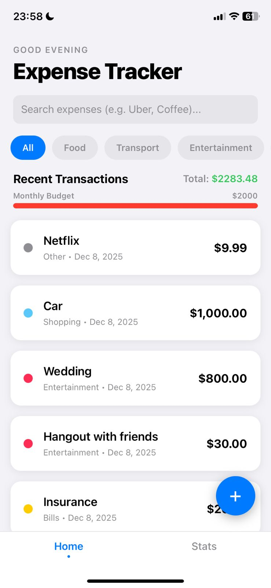
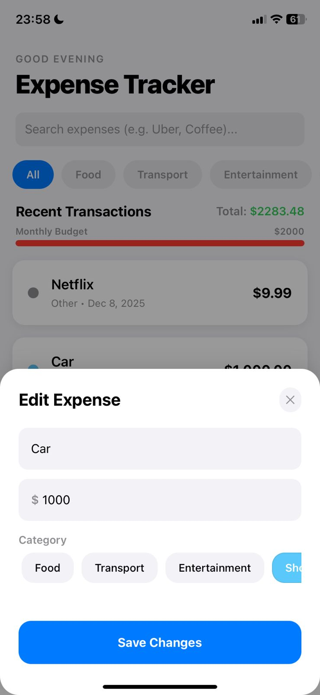
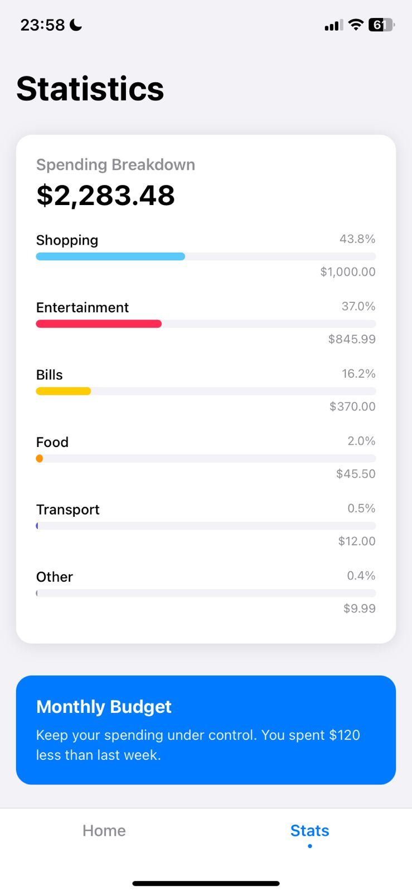
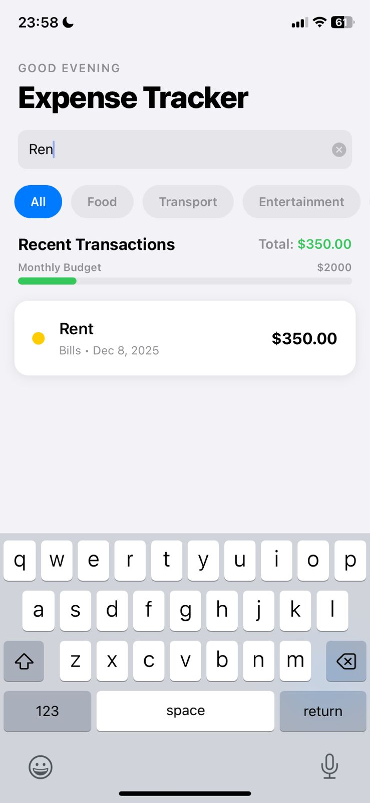

# 💰 Simple Expense Tracker (React Native / Expo)

A clean, modern, and cross-platform React Native application built using Expo.  
This app allows users to easily track, manage, edit, and categorize their daily expenses using the Context API for global state management.

This project focuses on delivering a streamlined user experience, demonstrating real-time data flow, modular architecture, and modern mobile design patterns.

---

## 🧭 Table of Contents

- [Overview](#-overview)  
- [Screenshots](#-screenshots)  
- [Features](#-features)  
- [Folder Structure](#-folder-structure)  
- [Technologies Used](#-technologies-used)  
- [Installation](#-installation)  
- [Running the Project](#-running-the-project)  
- [Author](#-author)

---

## 📝 Overview

The **Simple Expense Tracker** is designed for fast, everyday financial logging.

**Key principles:**

- **Modern UI/UX** → Minimalist iOS-inspired design with smooth modal transitions  
- **Global State Management** → Context API ensures instant updates everywhere  
- **Intuitive Interactions** → Tap to edit, swipe to delete, category tagging  
- **Modular Architecture** → Clean, scalable `src/` structure  

---

## 📸 Screenshots

<p align="center">
  
  
  
  
  
</p>

---

## ✨ Features

- ✅ **Full CRUD Functionality** (Create, Read, Update, Delete)
- 📲 **Full-screen modal entry** for adding expenses
- ✏️ **Tap to Edit** any expense
- 🗑️ **Swipe-to-Delete** on list items (gesture handler)
- 🏷️ **Category tagging** with colors
- 📊 **Statistics page** showing per-category totals
- 🔄 **Real-time updates** powered by Context API
- 📱 Clean, modern UI following iOS design cues

---

## 📂 Folder Structure

```bash
src/
├── components/
│   ├── expenses/
│   │   ├── ExpenseForm.js          # Add/Edit/Delete form (modal content)
│   │   ├── ExpenseItem.js          # Renders a single expense
│   │   └── ExpensesTable.js        # Full list with swipe-to-delete
│   └── ui/
│       ├── CategoryFilter.js       # Horizontal category pills
│       └── Chart.js                # Statistics visualization
├── context/
│   └── ExpenseContext.js           # Global state + CRUDs
├── constants/
│   └── colors.js                   # Central color palette
├── screens/
│   ├── HomeScreen.js               # Main list + add/edit modal
│   └── StatsScreen.js              # Statistics view
└── utils/
    └── formatUtils.js              # Date & currency formatting

App.js                               # Main entry point + navigation
```
---

## 💻 Technologies Used

| Technology | Purpose |
|-----------|---------|
| **React Native** | Cross-platform UI framework |
| **Expo** | Development environment & tooling |
| **Context API** | Global state management |
| **react-native-gesture-handler** | Swipe-to-delete gestures |
| **Ionicons** | Iconography |

---

## ⚙️ Installation

```bash
# Navigate to the project
cd ExpenseTracker

# Install dependencies
npm install
```

## ⚙️ Install Gesture Libraries

```bash
npx expo install react-native-gesture-handler react-native-reanimated
```
--- 

## 🚀 Running the Project

Start the Expo development server:

```bash
npm start
# or
npx expo start
```
Then:

- 📱 Scan the QR code with **Expo Go**
- 🍎 Press **i** for **iOS Simulator**
- 🤖 Press **a** for **Android Emulator**

---

## 👩‍💻 Author

**Alma Muzliukaj**  
Computer Science Student

- 🌐 GitHub: [https://github.com/almamuzliukaj](https://github.com/almamuzliukaj)  
- 📧 Email: almamuzliukaj@gmail.com

---
